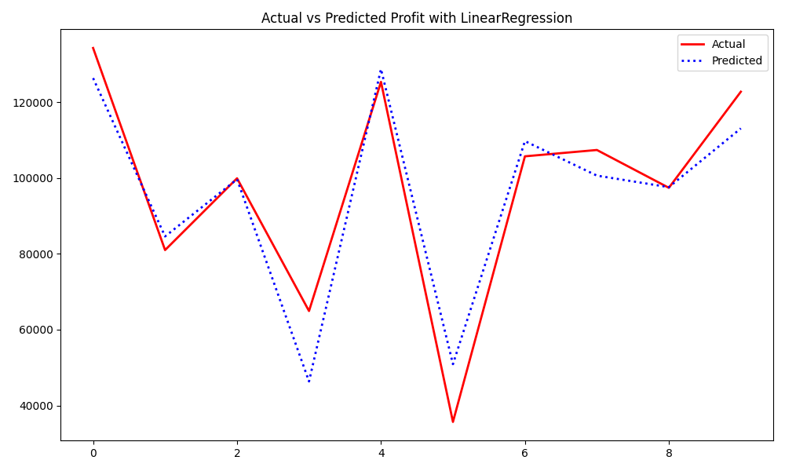
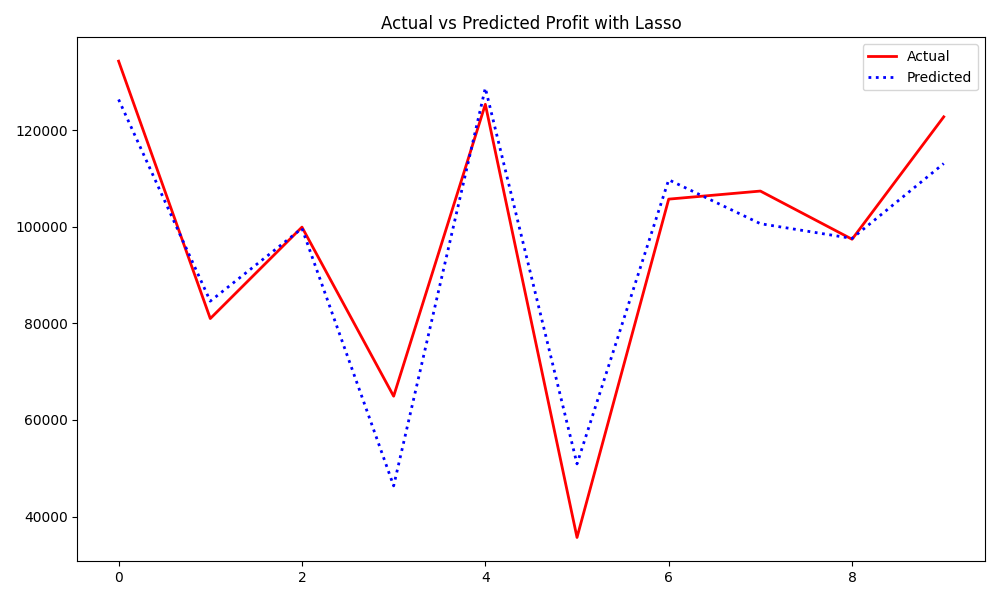
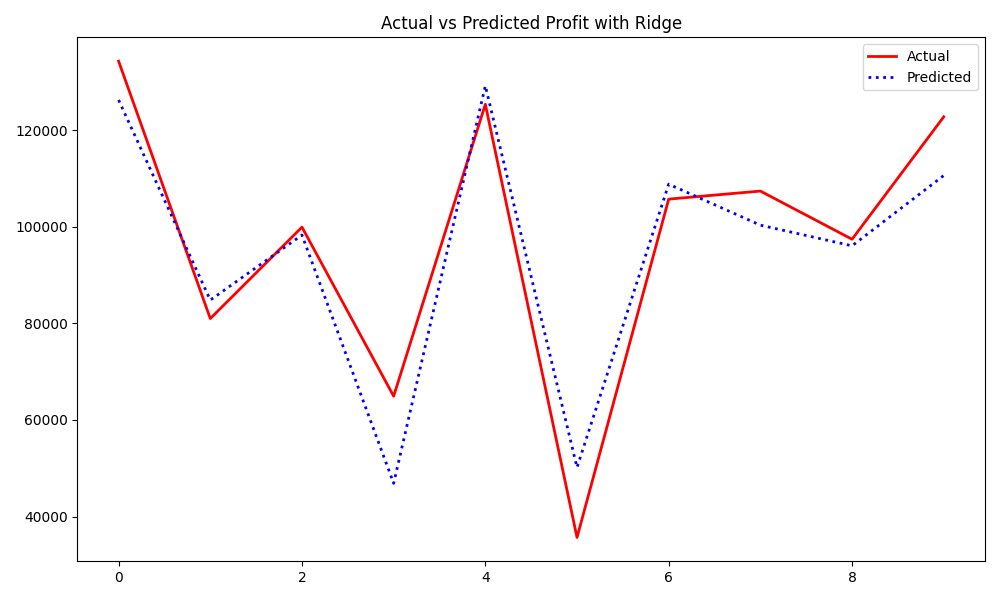
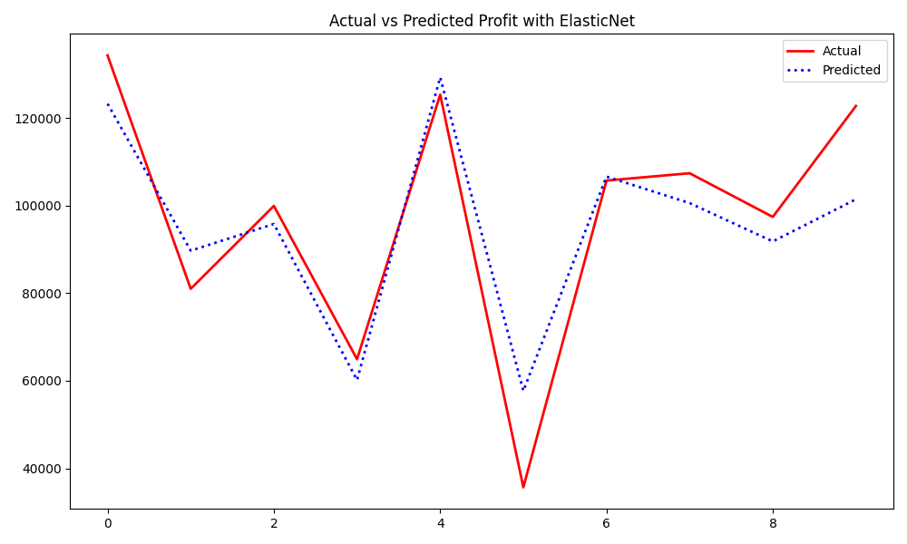
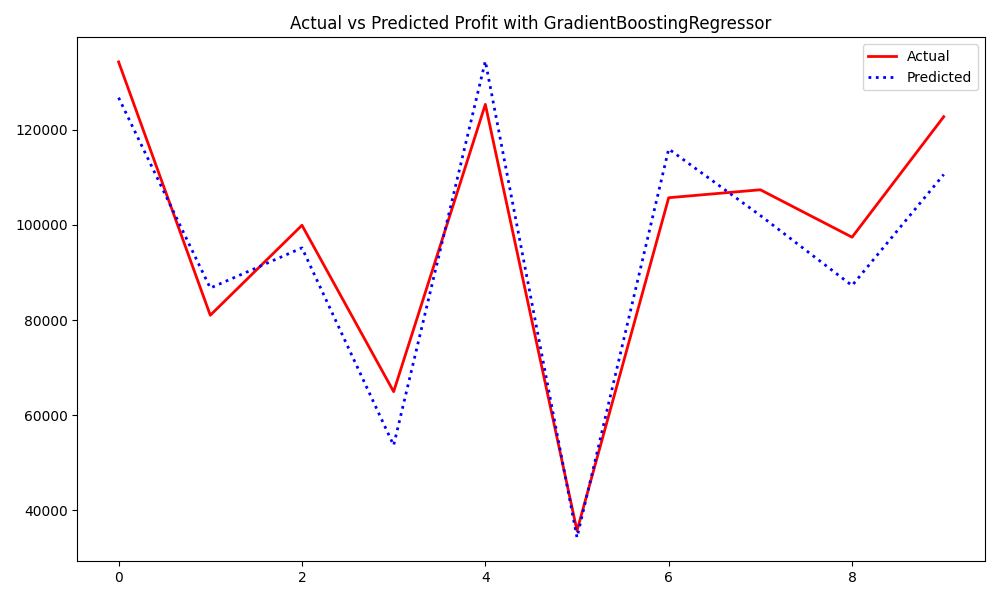
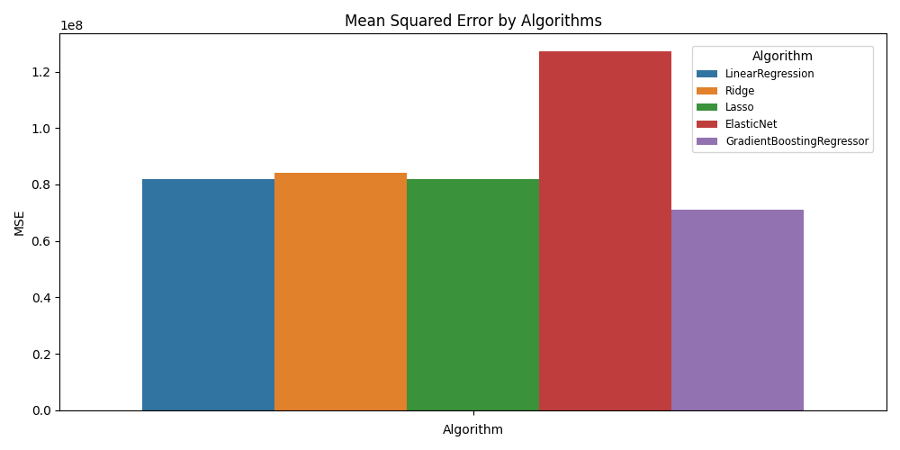
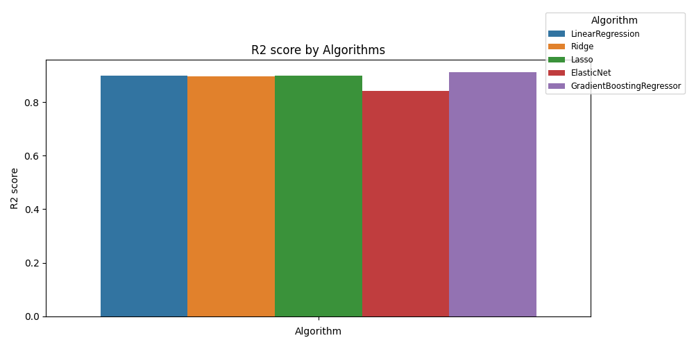

# Section: Overview

This project predicts the profit of a startup based on its expenses: R&D Spend, Administration, Marketing Spend, and State.
Input data is provided in CSV format, and prediction are made using multiple regression models

# Section: Model Comparision

Five regression models (Linear Regression, Lasso, Ridge, Elastic Net,Gradient Boosting Regressor) are trained, and their prediction is evaluated. 
Comparison plots of Actual vs Predicted profit value generated by the model are also made for each of the training algorithm, which are as follows:

1. Using Linear Regression algorithm 

2. Using Lasso algorithm

3. Using Ridge algorithm

4. Using Elastic Net algorithm 

5. Gradient Boosting Regressor algorithm

# Section: Model Performance 

Metrics like R2 score and MSE(Mean Squared Error) are calculated for each of the model, and given in the table below:

|      Algorithm          |      MSE      | R² Score |
|-------------------------/---------------/---------/
| Linear Regression       | 82,010,363.04 | 0.899    |
| Ridge Regression        | 84,140,006.50 | 0.896    |
| Lasso Regression        | 81,990,956.71 | 0.899    |
| ElasticNet              | 127,109,668.19| 0.843    |
| Gradient Boosting       | 70,980,351.53 | 0.912    |
______________________________________________________

# Section : Brief about

R2 score: Represents how well the models explains the variability of the target variable. Closer to 1 indicates better performance.
MSE or Mean Sqaure Error: Measures the average of the squares of the errors. Lower value indicates bettter accuracy.

# Section : Performance plots

Performance metrics Comparison plots considering all the algorithms are also generated as below

MSE plot:

R2 score plot:

# Section: Conclusion

Based on the performance metrics and visual analysis, the Gradient Boosting Regressor provides the most accurate predictions, and is the best-performing model
for this dataset.